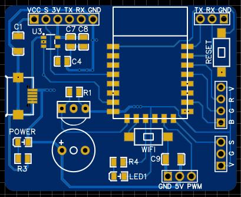
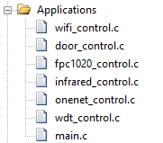
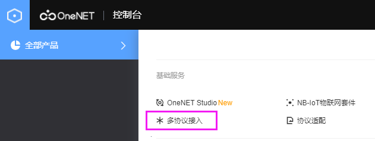
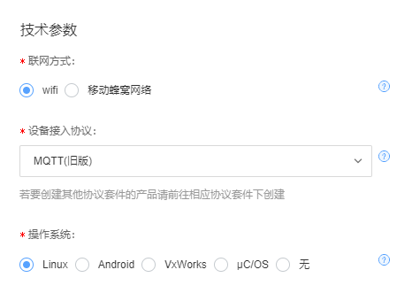
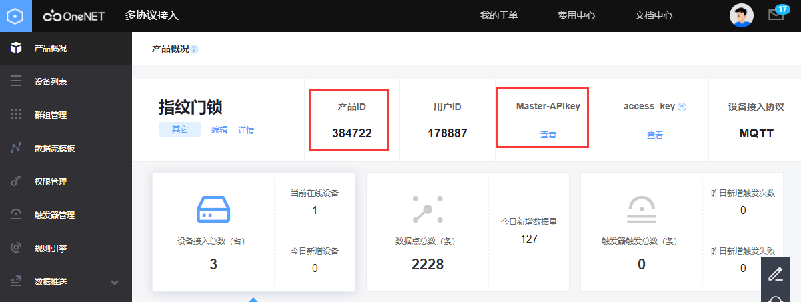
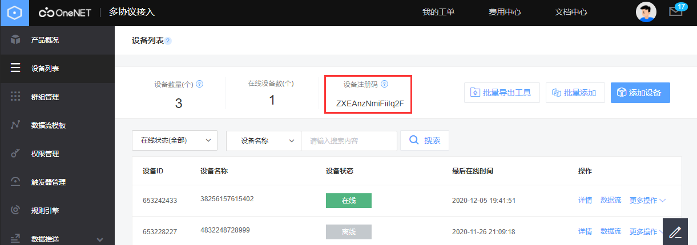
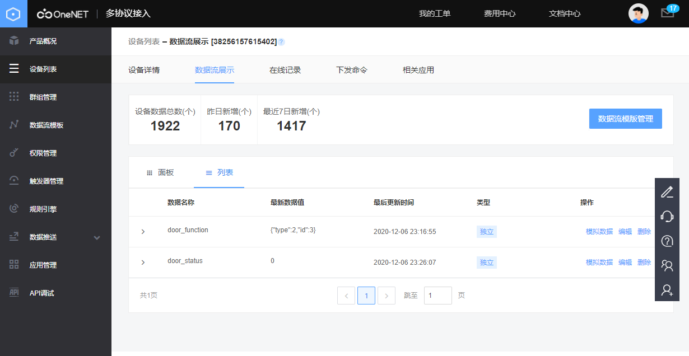
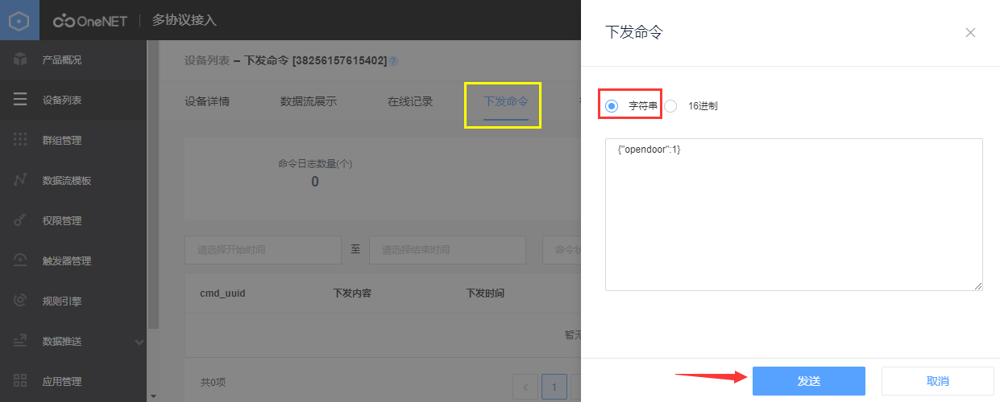
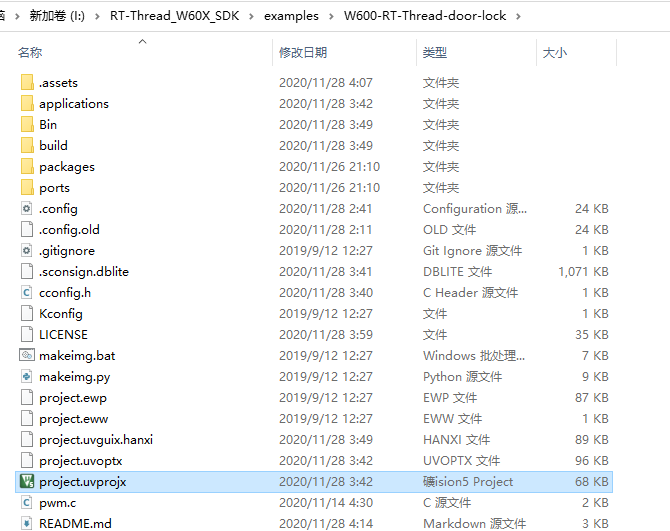
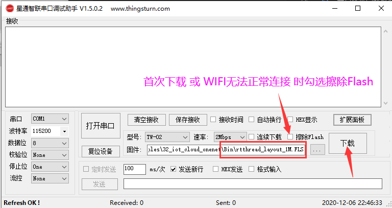

# 一、W600-RT-Thread智能指纹门锁

## 1.项目简介
主控芯片使用W600 的 [TW-03 WIFI模组](https://item.taobao.com/item.htm?id=576984059789)，指纹识别使用 [FPC1020A](https://detail.tmall.com/item.htm?id=612435938572)，这里开门使用MG996R舵机拉开门锁。W600运行RT-Thread操作系统并连接OneNET进行数据交互。

- 使用 W600 嵌入式WiFi芯片
- 使用 [FPC1020A](https://detail.tmall.com/item.htm?id=612435938572) 电容式指纹识别模块
- 支持指纹识别开门
- 支持NEC红外遥控开门
- 支持OneNET远程开门
- 支持oneshot web配网
- OneNET查看开门状态和记录开门方式和自定义id
- 网络自动检测保持连接状态
- 安卓APP控制开门和查看历史记录（未完成）


## 2.硬件电路


电路设计使用了立创EDA，项目所有硬件资料在立创开源硬件平台上。

- **硬件项目地址：<https://oshwhub.com/hanxiaohu/zhi-wen-men-suo>**
   
> 指纹模块的控制和指纹录入请参考FPC1020A SDK里面有详细资料和调试工具，在立创开源硬件平台附件里有FPC1020A SDK和离线版STM32指纹门锁项目全部资料。


## 3.W600 简介
芯片资料：[W600文档中心](https://docs.w600.fun/)

W600是北京联盛德自主研发设计的一款嵌入式WiFi芯片，该系列模块支持标准的802.11 b/g/n 协议，内置完整的 TCP/IP 协议栈。

600_SoC芯片集成 Cortex-M3 内核，内置 Flash，集成射频收发前端 RFTransceiver，CMOS PA 功率放 大器，基带处理器/媒体访问控制，支持SDIO、SPI、UART、GPIO、I²C、PWM、I²S、7816 等接口, 支持多种加解密协议，如 PRNG(Pseudo random Number Generator)/ SHA1/ MD5/ RC4/DES/ 3DES/ AES/ CRC 等。


## 4.代码
项目环境搭建和编译在 [项目编译指南](#jump) 中介绍 ，这里只是简单介绍项目组成



文件名|描述
---|:--:
wifi_control.c|wifi连接和oneshot配网
door_control.c|门状态获取，开门操作，RGBLED指示灯
fpc1020_control.c|指纹模块串口驱动和指纹对比
infrared_control.c|NEC红外遥控扫描
onenet_control.c|所有OneNET有关的操作
wdt_control.c|硬件看门狗
main.c|main函数

> 按住WIFI键然后复位可以进入oneshot配网，设备热点名称door_wifi_config，连接ap后打开<http://192.168.169.1>


## 5.OneNET

参考资料：[OneNET文档中心](https://open.iot.10086.cn/doc/multiprotocol)
### 5.1 创建项目
打开[OneNET控制台](https://open.iot.10086.cn/develop/global/product/#/console) 进入多协议接入



在MQTT（旧版）页面点击添加产品，设备接入协议确保是MQTT，其他随便填写



### 5.2 获取连接参数
项目创建成功后需要获取三个参数
- 产品ID
- Master-APIkey
- 设备注册码





### 5.3 配置RT-Thread
打开`rtconfig.h`文件将自己的这三个参数粘贴到对应位置


> 这里为了方便可直接修改`rtconfig.h`<br/>
> 如果需要继续开发本项目请使用env工具修改这三个参数，env工具使用方法参考 [Env 用户手册](https://www.rt-thread.org/document/site/programming-manual/env/env/)

### 5.4 数据流

设备上传了两个数据流
- 门开关状态
- 历史开门方式
  
进入设备详情查看


开关状态取决于检测开门状态的传感器，这里使用了一个霍尔传感器模块，将一块磁铁安装在门框上，关门时霍尔传感器靠近磁铁，并输出低电平，此时W600读取电平并上传到OneNET

历史开门记录由type和id组成，type类型定义在`applications\user_def.h`中

```c
enum {IR_MSG = 1, FP_MSG, REMOTE_MSG};
```

> 红外类型是1，指纹是2，OneNET远程开门是3 、红外id是遥控器nec码，指纹id是模块内存储指纹id，远程id是用户下发的id。

### 5.5 开门测试
这里可以手动测试远程开门功能



开门数据格式为：

```json
{"opendoor":id}
```

> 如果 id != 0 则开门，并上报开门方式和id。

验证开门标识代码在`applications\onenet_control.c`中，可自行数据格式

```c
static void onenet_cmd_rsp_cb(uint8_t *recv_data, size_t recv_size, uint8_t **resp_data, size_t *resp_size)
{

	int open_id = 0;
	cJSON *root = cJSON_Parse((char *)recv_data); 
	cJSON_item_get_number(root,"opendoor",&open_id);
  
    if (open_id != 0)
    {
        rt_sem_release(&door_open_sem);
    .....
}
```
<br/>

## 6. APP
通过安卓APP接入OneNET下发指令控制开门和查看门的开关状态，历史开门记录。

未完成

>注：如果需要其他方式接入OneNET进行控制，请参考 [OneNET文档中心](https://open.iot.10086.cn/doc/multiprotocol) 进行开发
<br/>

----
# 二、<span id="jump">RT-Thread项目编译指南</span>

## 1.RT-Thread 简介

 [RT-Thread](http://www.rt-thread.org/) 是一个来自中国的开源物联网操作系统，它具备非常强的可伸缩能力：从一个可以运行在ARM Cortex-M0 芯片上的极小内核，到中等的 ARM Cortex-M3/4/7系统，甚至是运行于 MIPS32、ARM Cortex-A 系列处理器上。 RT-Thread项目的源代码托管在 [GitHub repo](https://github.com/rt-thread) 上。

## 2.参考资料
- RT-Thread文档： [RT-Thread 文档中心](https://www.rt-thread.org/document/site)
- W60x参考文档：[W600 文档中心](https://docs.w600.fun/?p=rt-thread/start.md)
- W60x参考资料：[正点原子 W601 IoT开发板 ](http://www.openedv.com/docs/boards/iot/zdyz_w601.html)
- W60x\_RT-Thread源码：[GitHub](https://github.com/RT-Thread/W601_IoT_Board)
- 串口下载工具：[串口调试助手](https://download.w600.fun/tool/%E6%98%9F%E9%80%9A%E6%99%BA%E8%81%94%E4%B8%B2%E5%8F%A3%E8%B0%83%E8%AF%95%E4%B8%8B%E8%BD%BD%E5%8A%A9%E6%89%8B.7z)

## 3.环境搭建

### 3.1编译环境搭建
- Keil MDK
- 下载W60x\_RT-Thread SDK源码：[GitHub](https://github.com/RT-Thread/W601_IoT_Board)

### 3.2 工程目录介绍


docs文件夹下放着W600\_RTT相关的参考文档，建议先阅读 `UM3103-RT-Thread-W60X-SDK 快速上手.pdf `和 `UM3101-RT-Thread-W60X-SDK开发手册.pdf`

## 4.编译烧录

### 4.1 编译
将仓库克隆放到工程目录examples文件夹内

进入项目文件夹，双击打开 `project.uvprojx`工程文件，打开工程后直接编译即可（注意，一定要先搭建好Keil环境）。



固件生成在当前示例所在目录的Bin文件夹下。


### 4.2 烧录
打开星通智联下载调试软件选择`rtthread_layout_1M.FLS`烧录,型号可以不选，如果串口没有连接接复位，点击下载后需要手动复位W600。



>注意：
>1.  本项目使用W600芯片，FLASH为1M版本，选择`rtthread_layout_1M.FLS`烧录
>2.  其它烧录问题请参考:[W600固件烧录指南](https://github.com/w600/docs/blob/master/zh/app/download.md)
